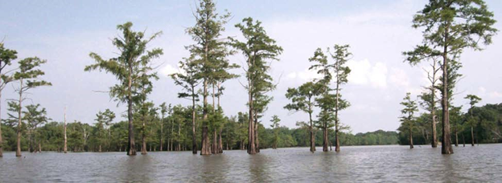

--- 
title: "Felsenthal WRIA demo"
author: "University of Georgia, Water Resources & Remote Sensing Laboratory"
date: "2017-10-05"
knit: "bookdown::render_book"
site: bookdown::bookdown_site
documentclass: book
bibliography: [book.bib]
biblio-style: apalike
cover-image: images/cypress_swamp.png
link-citations: yes
github-repo: adamdsmith/wria_felsenthal
url: ''
description: ""
always_allow_html: yes
---

# Preface {-}

(\#fig:cyp_swamp)Cypress Swamp at Felsenthal NWR

